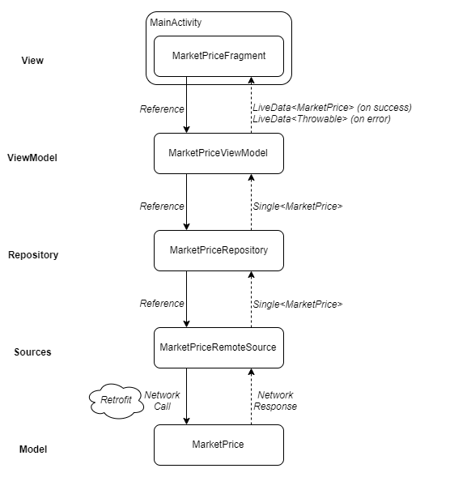
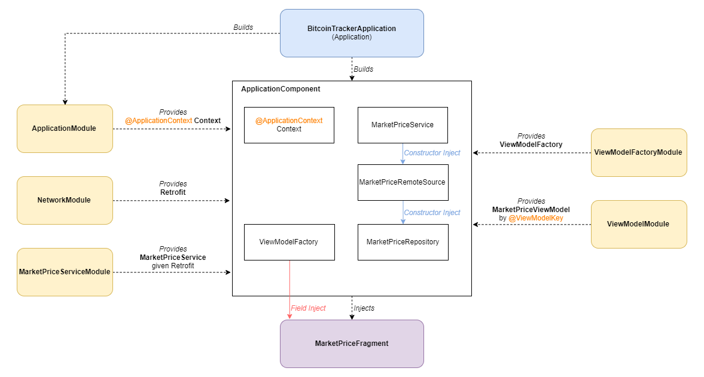

# BitcoinTracker
An Android application that fetches the current Bitcoin exchange rate using a network call to the Blockchain API and displays it in an appropriate graph of market price over time.

## Architecture
The application is built upon the MVVM architecture and according to Google's app architecture guidelines and SOLID principles.
Each layer of the application holds a reference to one layer below it and contacts the layer above it using a callback.
See diagram:

The repository layer and the layers below it are an asynchronous environment, so the components communicate using RxJava Singles that are subscribed on the IO scheduler and observed on the Android Main Thread scheduler.
Once the data reaches the ViewModel layer, it is converted to LiveData, because LiveData is lifecycle-aware and will provide the data to the View on the UI thread, only if it's in the foreground.

Dependency graph diagram:

## Technologies used
* [Dagger2](https://github.com/google/dagger) - Dependency Injection
* [Retrofit2](https://github.com/square/retrofit) - Remote API calls and data handling
* [OkHttp3](https://github.com/square/okhttp) - HTTP Client
* [RxJava2](https://github.com/ReactiveX/RxJava)+[RxAndroid](https://github.com/ReactiveX/RxAndroid) - Asynchronous operations
* [GSON](https://github.com/google/gson) - JSON Parsing
* [GraphView](https://github.com/jjoe64/GraphView) - View for displaying data as graph
* [SimpleConnectivityDetector](https://github.com/cherrydaniel/SimpleConnectivityDetector) - Internet connectivity detection library by me :)
* [Timber](https://github.com/JakeWharton/timber) - Logging
* DataBinding - Binding UI with ViewModel
